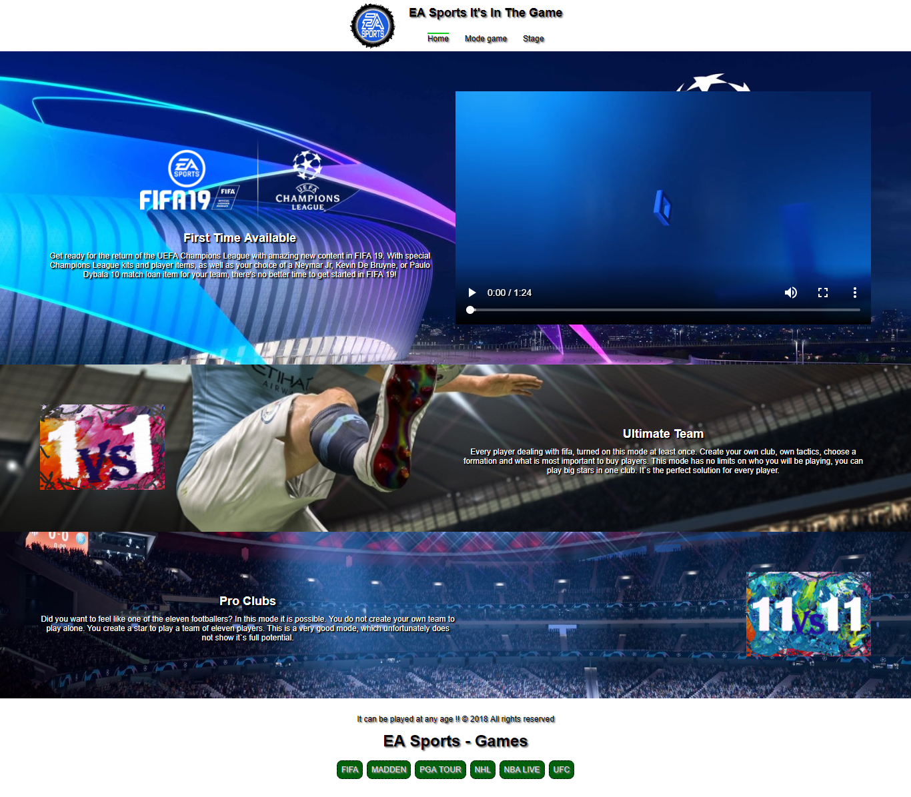

# EA Sports FIFA
**Soccer Video Game FIFA** game mode, stage and adventure of the Polska Panda. Game description written by an experienced player. How really this game looks like to me.

## Table of contents
* [Getting Started](#getting-started)
* [Screenshots](#screenshots)
* [Technologies](#technologies)
* [To do](#to-do)
* [Acknowledgments](#acknowledgments)
* [Status](#status)
* [Author](#author)

## Getting Started
It does not have any requirements. The principle of "copy, paste". It was created to start learning the animation on the page. It is my first time with Adobe Illustrator CC and files .svg. I also wanted to commemorate the chapter of playing virtual clubs that I closed.

## Screenshots

## Technologies
* HTML
* CSS
* JS

## To do
* The Appearance
* Use of new knowledge to improve the site

## Acknowledgments
* SVG is powerful format, which you can easily animation.
* windowHeightLoad = _window.innerHeight + window.scrollY_ - It is our size of website.
* **X.offsetTop** - It is the place where the element is located on the page.

## Status
To improve

## Author
Created by **_cookavsky_** - [FIFA](https://www.fifa.cookavsky.com/) - for friends Polska Panda.
